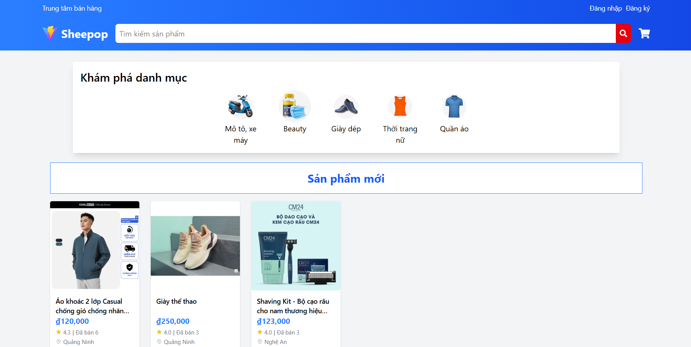
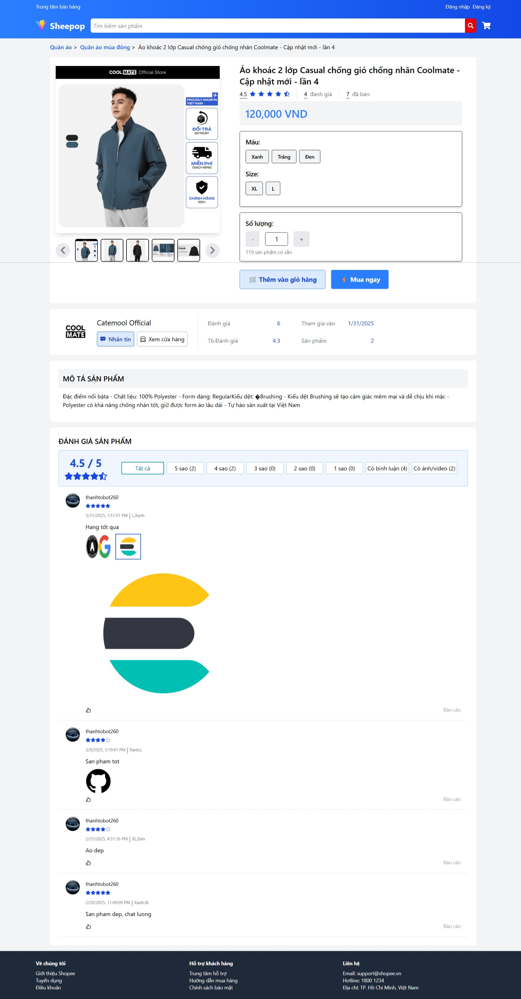
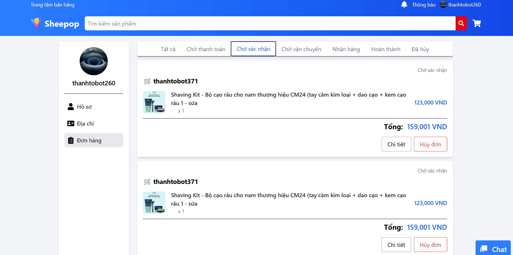
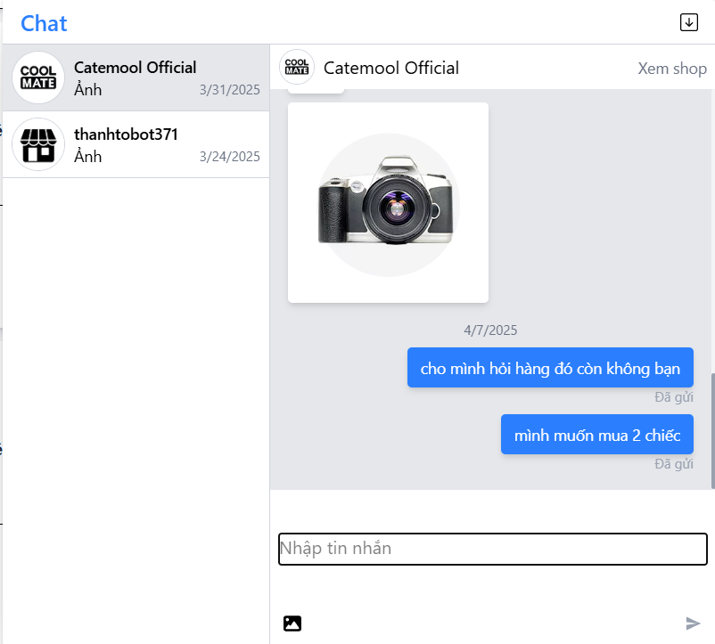
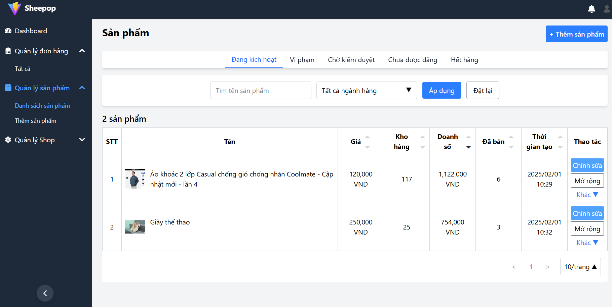
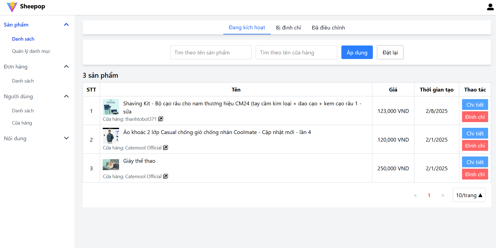
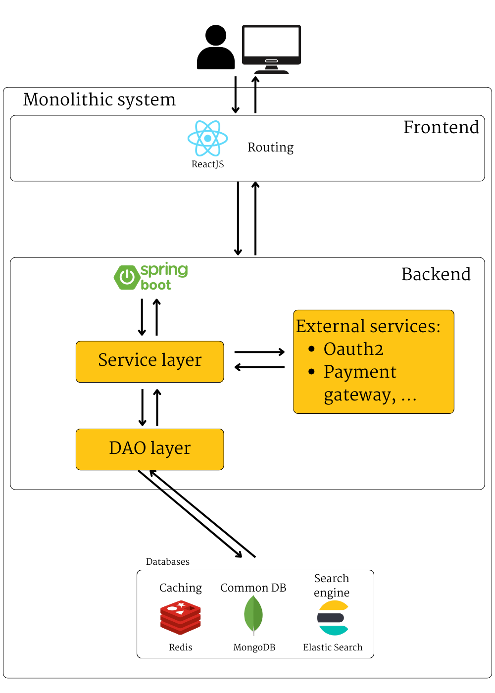

# Sheepop

**Attention:** Due to some issues with the changing list of provinces and cities in Vietnam, I will not be implementing the auto-import feature for locations into the database. As a result of this missing component, core functionalities will be affected, and the application will not operate as intended (though you can still run it). If you wish, you can manually input the data, and everything will function normally. 

## 1. Introduction
An E-Commerce website that follow C2C (Customer-to-Customer) model, where a buyer can alse be a seller.

### Getting started with Docker compose

1. Get the latest source code
2. Fill information to [.env_sample](https://github.com/NgNhatThanh/Sheepop/blob/main/backend/src/main/resources/.env_sample) file, and change it's name to `.env`
3. Open terminal at the root folder of the project, run `docker compose up -d`, and wait for some minutes
4. Access the website via `http://localhost:5173`, you already have an admin account `admin/admin`

## 2. Key features

- **Basic authentication:** login, register, forgot password, change password
- **Order stuffs** 
- **Online banking**
- **For seller:** 
  - Manage shop's products, orders
- **Realtime chat and notifications**

## 3. Technologies

**BackEnd**

- Spring boot
- Websocket
- Maven

**FrontEnd**

- ReactJS
- TailwindCSS

**Database**
- MongoDB
- Redis
- ElasticSearch

**Authentication**
- JWT
- Oauth2 with Google

**Storage**
- Cloudinary for storing images

**External Service**
- VNPay for online banking
- GHN for calculating shipping fee

## 4. Screenshots
  Home page
  
  Product detail page
  
  User's orders
  
  Chat
  
  Seller's page
  
  Admins' page
  

## 5. Diagrams

System architecture

## 6. Contributing

Pull requests are welcome. For major changes, please open an issue first to discuss what you would like to change.
